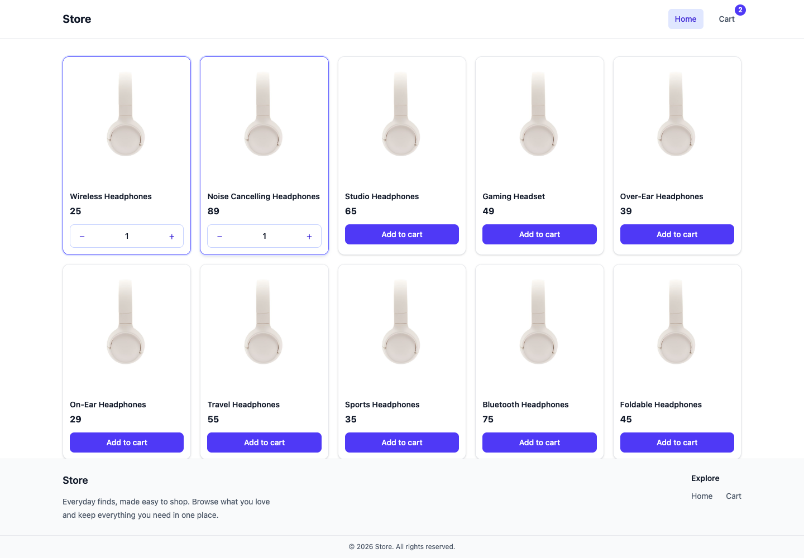

# Storefront UI

A small ecommerce interface built with React, Vite, React Router, and Tailwind CSS. It currently showcases ten headphone products and a working client-side cart.



## Features

- Responsive product grid with reusable product cards
- Add products and adjust quantities with plus and minus controls
- Cart badge showing the total number of units
- Cart screen with product quantities, line totals, and the final total
- Home and Cart navigation with an active-route highlight

## Run locally

```bash
npm install
npm run dev
```

Open the local URL printed by Vite. Run `npm run lint` to check the code or `npm run build` to create a production build.

## How the cart works

The product list is in `src/productlist.jsx`. `Layout` owns the selected product IDs and shares the cart actions with Home and Cart through React Router's `Outlet` context. Repeated IDs represent multiple units of a product. The Cart screen looks up each selected product in the list and calculates its total.

This is a UI demo: cart contents stay in memory and reset on page refresh. Checkout and account sign-in are not included.
